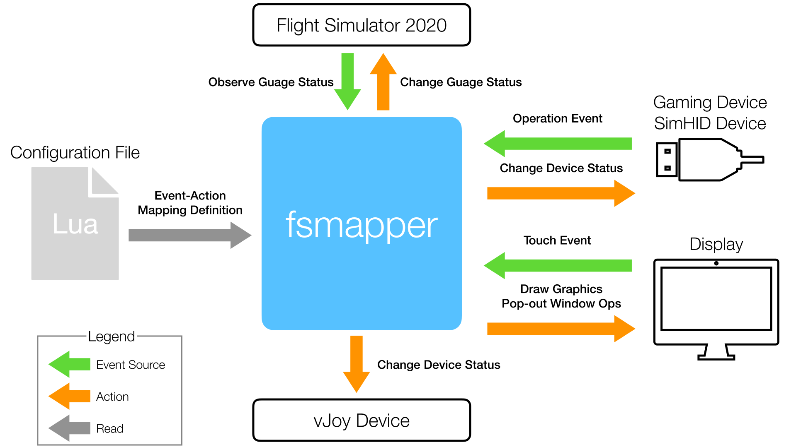

fsmapper
===


fsmapper is a Windows application to connect various input and output devices to filght simulator.<br>
Initially this software was planned to connect my DIY controller device, [SimHID G1000](https://github.com/opiopan/simhid-g1000), to FS2020.
But fsmapper is designed to handle common gaming controller device now.

fsmapper allows to:
- Bind the operation of SimHID devices or USB gaming controller device to the operation of arbitary operable unit in a cockpit of a aircraft running on FS2020
- Observe variables in FS2020 to represent arbitary gauge's status such as engine warning lamp, then reflect it's status to real device
- Build virtual cockpit including original gauges on the secondary display (and 3rd display and so on) with touch operable capability, this user defined virtual cockpit interacts with FS2020 using same mechanism as the above two capabilities
- Change location, size, and/or visibility of pop-out windows of FS2020 such as G1000 PFD according to the operation of SimHID device of USB gaming controller device, that means not only the above virtual cockpit on the secondary display can consits popout window as part, but also one phisical display device can be used for mulitiple purpose by changing the display dynamically ([a movie embedded below](#captured-window) shows this capability, one device is used as G1000 PFD and G1000 MFD with changing dynamically)
- Remap SimHID device or USB gaming controller device operation to virtual joystick device operation using vJoy driver, or to synthesized keystrokes (emulated keystrokes)

The above functions are configuread flexibly by writing a Lua script.<br>
fsmapper handles various devices and other softwares as event sources and calls Lua functions defeined in correspondence with the events that occur.
And fsmapper also provides various objects and functions to interuct with outer environment of fsmapper as below.

<p align="center">

</p>

## How to build and install
1. **Requirements**<br>
Make sure that the following softwares are installed in advance.
    - Visual Studio 2019 or 2022 whilch is instaled with folowing workloads:
        - Universal Windows Platform development
        - C++ desktop development
        - C++ game development
    - Windows App SDK 1.0: [Visual Studio Extension (C++)](https://docs.microsoft.com/en-us/windows/apps/windows-app-sdk/downloads)
      and [Runtime](https://docs.microsoft.com/en-us/windows/apps/windows-app-sdk/downloads)<br>
      Note: Donwload and install the latest version of **1.0** series.
    - Flight Simulator 2020 SDK 
    - [nuget.exe](https://www.nuget.org/downloads) should be placed at the folder which is indicated by PATH environment variable.

2. **Running a console**<br>
Run ```cmd.exe``` or ```PowerShell.exe``` on any console. Note that environment variables must be set to complie x64 binaries.<br>
The one of easiest way is using the following shortcut made when Visual Studio was installed.
    - x64 Native Tools Command Prompt for VS 2022
    - x64 Native Tools Command Prompt for VS 2019


2. **Downloading source codes**<br>
    ```shell
    $ git clone --recursive https://github.com/opiopan/fsmapper.git
    ```

3. **Preparing dependent modules**<br>
    Downloading and compiling Lua source codes and downloading vJoySDK will be done by following step.<br>
    ```shell
    $ cd fsmapper\modules
    $ .\prepare_modules.bat
    ```

4. **Compiling**
    ```shell
    $ cd ..\src
    $ nuget restore fsmapper.sln
    $ msbuild /p:Configuration=Release
    ```
5. **Making deployable package**
    ```shell
    $ cd ..\deploy
    $ .\deploy.bat
    ```

6. **Installing**<br>
    Copy fsmmapper folder to any folder you want.
    ```shell
    $ xcopy fsmapper <DESTINATION_FOLDER_PATH>
    ```
## How to use fsmapper

### Optional softwares
fsmapper has funcions to collaborate with softwares below. These softwares are not mandatry to work fsmapper but they can enhance fsmapper's capabilities.<br>
I strongly recomend to install them.

- [vJoy : https://sourceforge.net/projects/vjoystick](https://sourceforge.net/projects/vjoystick)<br>
vJoy is a device driver wich behaves as virtual joystick. <br>
fsmapper has several functions to change button status, axis position, and POV position of vJoy device.
By using vJoy device, fsmapper provide very flexible cconfigurability of human operable devices.<br>
Followings are just example what fsmapper can do that collaborate with vJoy.
    - change the response curve of jyoystick axis for each aircraft
    - change the relation between phisical button and vJoy virutal button depending on the positon of a switch

- [MobiFlight WASM Module : https://github.com/MobiFlight/MobiFlight-WASM-Module](https://github.com/MobiFlight/MobiFlight-WASM-Module)<br>
This WASM module working as add-on of FS2020 allows a outer-process utility to execute arbitary [RPN script](https://docs.flightsimulator.com/html/Additional_Information/Reverse_Polish_Notation.htm) and to observe change of aircraft inner state holding in local variables such as LVARs.<br>
fsmapper interacts with FS20202 via SimConnect API. 
SimConnect API allows a outer-process to acess only [SimVars](https://docs.flightsimulator.com/html/Programming_Tools/SimVars/Simulation_Variables.htm) and [Event IDs](https://docs.flightsimulator.com/html/Programming_Tools/Event_IDs/Event_IDs.htm). However that isn't sufficient to controll all operable object in  a cockpit or to know all gauge status in ac cockpit  for presenting on a other DIY gauge (or on the secondary display).<br>
To controll and kow all of cockpit gauges, accessing local variables in a aircraft module is needed, and [Gauge API](https://docs.flightsimulator.com/html/Programming_Tools/WASM/Gauge_API/Gauge_API.htm) is appropriate for this purpose. But unfortunately, this API can be used only in WASM module. <br>
MobiFlight WASM Module solves this problem. fsmapper can access all local variable by communicating with this WASM module.


### Configuration file
To briefly describe the function of fsmapper is that waiting event such as position change of the joystick axis then invoking the action corrensponds to the occured event.<br> 
The rule of mapping between the events and the actions is described by [Lua 5.4](https://www.lua.org/manual/5.4/manual.html) script.
The executable file of fsmapper, fsmapper.exe, provides GUI. However fsmapper has no capability to edit the event-action mapping rules. It just can behave like a dashboard to show the condition and state of event-action mapping process.<br>
Therefore, the first thing you have to do is writing a configuration file by Lua script.

I haven't writen the specification of this configuration file yet but some examples are pleaced [here](samples).

### Running fsmapper
The first time of launching fsmapper, you need to specify the configuration Lua script file by press the open button located to the left of the Run button. After that start event-action mapping process by press the Run button.<br>
At the second and subsequent famapper launches, same script file will be executed automatically.

When event-action mapping process is aborted due to error, the status indicater placed at the top of window blinks red.<br>
In this case, refere the error message for details by acessing the message console page as below.

<p align="center">

</p>

### Captured window
fsmapper has a function to controll visibility and position of any window ownd by other process. This function is designed to enable a display as multipurpose, especially to handle fs2020 puped out instrument window like [this movie](https://raw.githubusercontent.com/wiki/opiopan/simhid-g1000/images/movie.gif).

Those windows controlled by fsmapper are called "captured window" and those are specified by ```mapper.view_elements.captured_window()``` function in Lua script.<br>
Unfortunately, FS2020 SDK does not allow to controll poped out window and does not provide a way to recognize the difference between poped out windows. From fsmapper point of view, all FS2020 poped out windows looks same.<br>
So Lua script defines just placefolder, You need to specify which actual window corresponds to captured window definition at run time as below.

<p align="center">

</p>

### Avoiding touch problems of poped out window
It is well known that the poped out window of avionics which has touch operable capability such as Garmin G3X doesn't work well with the touch operation, even though it works with the mouse operation.<br>
fsmapper provides the workaround solution for this problem. You will be able to operate poped out windows with the touch operation if those windows will be managed as  **captured window** mentiond previous section.

I don't know the true reason why touch operations are ignored by FS2020. However I assume that this problem is caused by the mechanism to recognize the mouse status change.<br>
I assume that FS2020 polls the current mouse status periodically by using DirectInput API instead of handling the windows message stream such as ```WM_LBUTTON_DOWN```. This method may drop some status change events when multiple events occur in a time shorter than the polling interval.<br>
Mouse messages generated as a result of tapping are exactly this situation. To avoid noise such as palm contacts, Windows delays touch related messages when first contact is recognized. As a result, ```WM_LBUTTON_DOWN``` and ```WM_LBUTTON_UP``` messages will occur at the almost same time when you tap a display. In this case, FS2020 cannot recognize mouse button state changes.

Based on this hypothesis, fsmapper removes mouse events generated as a result of a touch operation from the mouse event queue. on the other hand, fsmapper generates mouse events with appropriate intervals.<br>
If you want to stop this behavior, specify the value as ```false``` for parameter ```avoid_touch_problems``` of ```mapper.view_elements.captured_window()``` function.

``` Lua
local element1 = mapper.view_elements.captured_window{
    name = "Apps other than  FS2020",
    avoid_touch_problems = false,
}

local element2 = mapper.view_elements.captured_window{
    name = "Garmin G3X",
}
```

## Sample Scripts
This repository includes several configuration scritps for practical use of [SimHID G1000](https://github.com/opiopan/simhid-g1000) at [here](samples/practical).<br>
To use these scripts, [vJoy driver](https://sourceforge.net/projects/vjoystick) and [MobiFlight WASM module](https://github.com/MobiFlight/MobiFlight-WASM-Module) must be installed. In addition, it's assumed that the virtual serial Port for SimHID G1000 is recognaized as **COM3** and the display for SimHID G1000 is secondary monitor (**moniter No. is 2**).<br>
If your environment is not same, change ```config``` table defined at the top of each script as below according to your environment.

``` Lua
local config = {
    simhid_g1000_identifier = {path = "COM3"},
    simhid_g1000_display = 2,
}
```

More complex scripts can be found in [this repository](https://github.com/opiopan/scripts_for_fsmapper). <br>
I actually use the scripts stored in that repository, and the way how to switch the configuration correspond to current aircraft can be found in those scripts.


### [samples/pracctical/g1000.lua](samples/practical/g1000.lua)


This script can be used with all aircrafts which install Garmin G1000.<br>
This script handles two poped out windows as captured windows, one is the PFD of G1000 and the other one is the MFD of G1000. <br> 
The contents displayed on the monitor of SimHID G1000 can be switched between the PFD and the MFD by operationg the switches placed at the right end of the SimHID G1000 housing and left end one.<br>
All buttons and knobs of the SimHID G1000 are work for every displayed contents. For example, pushing the "menu" button cause displaying the menu on the PFD when the monitor of SimHID G1000 shows the PFD.

In this script, you can see the following example usage of fsmapper.
- Basic eveent handling for SimHID device
- Cockpit operable utits of a FS2020 aircraft by sending [Event IDs](https://docs.flightsimulator.com/html/Programming_Tools/Event_IDs/Event_IDs.htm)
- Poped out window of FS2020 handling (captured window function)
- Switchable views

### [samples/practical/g1000_x56.lua](samples/practical/g1000_x56.lua)
This script is added some codes to the aboeve script.<br>The deference between both scripts is only the part to handle logicool G-56.<br>
In this scrit, you can see the following example usage of fsmapper.
- Basic event handling for USB gaming controller
- Feeding values to vJoy device
- Deferred event handling

### [samples/practical/a32nx.lua](samples/practical/a32nx.lua)


This script was written for [FlyByWire A32NX](https://flybywiresim.com).<br>
This is more complex than the above two scripts. This script provides the integrated virtual cockpit which contains physical operable units such as buttons and knobs, touch controllable units on the monitor, and poped out window contents such as PFD.<br>
This script includes several sub-module scripts at [here](samples/practical/a32nx), and it also uses several bitmap image at [here](samples/practical/assets) to render each operable units.


In this scrit, you can see the following example usage of fsmapper in addition to ```g1000_x56.lua``` case.
- Observing the aircraft status represented by [RPN script](https://docs.flightsimulator.com/html/Additional_Information/Reverse_Polish_Notation.htm)
- Changing the aircraft status by executing [RPN script](https://docs.flightsimulator.com/html/Additional_Information/Reverse_Polish_Notation.htm)
- Drawing graphics on the screen
- Handling the touch events and mouse events occured on the screen

This script defines following 5 views. Every view consist FS2020 poped out window and self rendered operable gauges.

|| Poped out windows | Self rendered operable units
|-|-----------------|----------------------
|1| PFD<br>FCU       | buttons on the FCU<br>BARO indicator
|2| ND               | buttons and toggle switches on the EFIS controll unit<br>auto brake buttons<br>etc
|3| Upper ECAM | engine mode selectors, master engine switch and engine status indicators<br>APU controll switches<br>battery controll switches and voltage indicators
|4|Lower ECAM| ECAM page selector buttons
|5|MCDU| MCDU buttons

The width of every view is a half width of the SimHID monitor width. So two views can be displayed simultaneously side by side.<br>
By pressing soft-keys placed at bottom of SimHID G1000, two views to show can be specified.<br>
And the switches placed on the left end and the right end of SimHID G1000 housing can also control views to show.

<p align="center">

</p>

The pushbuttons rendered on each view can be operated by tapping them. The toggle switches include engine master switches and the selector knobs can be operated by flicking them.
The correspondence between SimHID G1000 operations and A32NX operations are shown below.

| SimHID G1000      | A32NX 
|-------------------|---------
|NAV volume knob    |SPD/Mac knob on FCU except pull operation
|NAV swap button    |Pulling Speed Knob on FUC
|HDG knob           |HDG/TRK knob on FCU except pull operation
|HDG button         |Pulling HDG/TRK knob on FCU
|AP button          |AP1 button on FCU
|FD button          |FD button on EFIS
|APR button         |APPR button on FCU
|ALT outer knob     |Increase / Decrease altitute indicator on FCU by 1000 feet
|ALT inner knob     |Increase / Decrease altitute indicator on FCU by 100 feet
|ALT knob push button|Pushing ALT knob on FCU
|FLC button         |Pulling ALT knob on FCU
|COM volume knob    |V/S or FPA knob on FCU except pull operation
|COM swap button    |Pulling V/S or FPA knob on FCU
|COM knob           |Freequency selector knob on RMP panel
|BARO knob rotation |Manipuration of the value displayed in the barometer reference window
|BARO knob push button|Switching barometer reference mode between QNH and standard barometer reference
|Range knob rotation|Range selector switch on EFIS
|Range knob joystick|Changing the mode displayed on the respective ND
|NAV inner knob     |Adjusting the brightness of PFD, ND, upper ECAM, and lower ECAM in sync
|NAV outer knob     | Adjusting the brightness of both the weather rader image and the EGPWS terrain image on ND
|FMS inner knob     | Adjusting the brightness of FCU display
|FMS outer knob     | Adjusting the brightness of all glareshields in sync