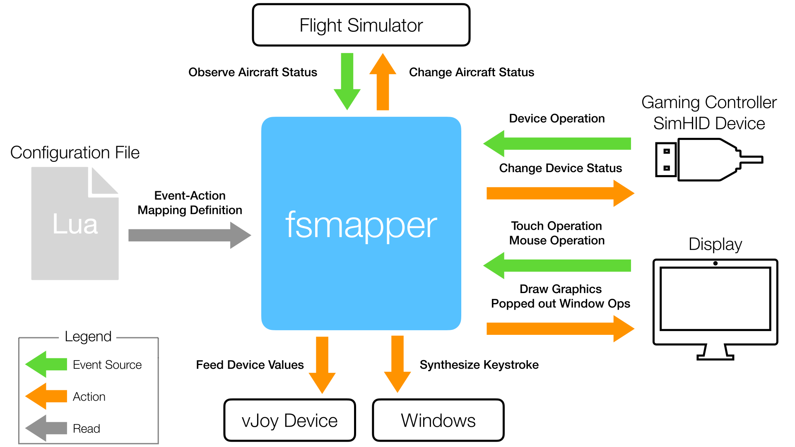

NOTE:|
:-|
The [**fsmapper User's Guide**](https://opiopan.github.io/fsmapper) is available [here](https://opiopan.github.io/fsmapper). Please refer to this guide for instructions on how to use fsmapper

fsmapper
===


fsmapper is a Windows application designed to connect a variety of input and output devices to flight simulators.
Originally, the development of fsmapper began to connect my DIY controller device, [**SimHID G1000**](https://github.com/opiopan/simhid-g1000), to FS2020. However, it has now evolved to encompass functionalities that allow the creation of a home cockpit using a wide range of devices.<br/>
fsmapper targets not only home cockpit builders aiming for an exact replica of a specific aircraft's cockpit,
but also general flight simulator players who have limited equipment and space but want to efficiently operate a wide range of aircraft
(The truth is, I fall into the latter category as well).

Although fsmapper offers a multitude of functions, it can be summarized into following three main aspects when viewed from the perspective of improving device and space utilization efficiency, as mentioned earlier.

- **Interaction between devices and FS2020**<br/>
  You can reflect the operations of various devices, including custom-made ones, onto various cockpit controls. 
  fsmapper utilize [Gauge API](https://docs.flightsimulator.com/html/Programming_Tools/WASM/Gauge_API/Gauge_API.htm), allows support for operations not configurable within FS2020's **Controls options**. Additionally, it's possible to mirror the status of in-flight aircraft lamps and instrument panels onto physical devices.<br/>
  The interaction rules between devices and FS2020 can be automatically adjusted to suit different aircraft.

- **Changes to Input Device Characteristics**<br/>
  You can flexibly modify the characteristics and behaviors of input devices,
  such as altering the linearity of analog axes, changing polarity for alternate switch, generating events that account for the position and hysteresis of analog axes, and so on. 
  This allows for consistent handling of the same throttle device across aircraft with and without afterburners, or enables adjustments for actions like fuel cut-off and thrust reversal.

- **Virtual instrument panel utilizing Touchscreen Monitors**<br/>
  In a multi-monitor environment, you can construct virtual instrument panels on the screen. Particularly when using a touchscreen monitor, intuitive actions like tapping or flicking can be used to manipulate switches and knobs displayed on the screen.
  By configuring windows that pop out with **`[Right Alt]` + `[Mouse Click]`** as elements of the virtual instrument panel, constructing modern glass cockpits becomes seamless.<br/>
  fsmapper excels in handling FS2020's pop-out windows, allowing natural integration of these as part of the instrument panel by hiding title bars and window frames. It also offers workarounds for touch operation glitches inherent in FS2020's implementation.

If you watch [this video](https://youtu.be/Ee6uw2BYdgE), you'll get a better understanding of what can be achieved with fsmapper as described above.<br/>
In this video, A320's virtual instrument panels are assembled on a 10.5-inch touchscreen by combining six popup windows 
(FCU, PFD, ND, ECAM x 2, MCDU) and user-defined instruments and switches. 
Additionally, by dynamically switching and displaying the instrument panels,
it enables diverse information representation and manipulation even on a small screen.

All the functionalities mentioned earlier are accessed through [Lua 5.4](https://www.lua.org/manual/5.4/) scripts.
Although fsmapper is implemented as a Windows GUI application, 
it actually only features a dashboard to display operational status and a console function to show messages during script execution,　particularly error messages.
If there wasn't a necessity to allow users to select FS2020's pop-out windows,　I believe it would have been implemented as a command-line interface (CLI).

<p align="center">

</p>

The diagram above illustrates how fsmapper works. fsmapper patiently waits for events (***green arrows***) such as operations from various input devices, touchscreen interactions, and changes in the aircraft's status within FS2020. Upon detecting an event, fsmapper executes the corresponding action. These actions are Lua function objects that allow interaction (***orange arrows***) with various objects such as aircraft controls within FS2020, graphical representation on the screen, and data output to devices, facilitated through Lua functions and Lua objects provided by fsmapper.

The '**Configuration File**' specified by the user during fsmapper execution refers to the definition of the correspondence between these events and actions as a Lua script.

## How to build and install
You can download and install binary packages from [here](https://github.com/opiopan/fsmapper/releases).<br>
If you build yourself, follow the steps below.

1. **Requirements**<br>
Make sure that the following softwares are installed in advance.
    - Visual Studio 2022 whilch is instaled with folowing workloads:
        - Universal Windows Platform development
        - C++ desktop development
        - C++ game development
    - [Windows App SDK 1.5 runtime](https://docs.microsoft.com/en-us/windows/apps/windows-app-sdk/downloads):<br>
      Note: Donwload and install the latest version of **1.5** series.
    - Flight Simulator 2020 SDK 
    - [nuget.exe](https://www.nuget.org/downloads) should be placed at the folder which is indicated by PATH environment variable.

2. **Running a console**<br>
Run ```cmd.exe``` or ```PowerShell.exe``` on any console. Note that environment variables must be set to complie x64 binaries.<br>
The one of easiest way is using the following shortcut made when Visual Studio was installed.
    - x64 Native Tools Command Prompt for VS 2022

3. **Downloading source codes**<br>
    ```shell
    $ git clone --recursive https://github.com/opiopan/fsmapper.git
    ```

4. **Preparing dependent modules**<br>
    Downloading and compiling Lua source codes and downloading vJoySDK will be done by following step.<br>
    ```shell
    $ cd fsmapper\modules
    $ .\prepare_modules.bat
    ```

5. **Compiling**
    ```shell
    $ cd ..\src
    $ nuget restore fsmapper.sln
    $ msbuild /p:Configuration=Release
    ```
6. **Making deployable package**
    ```shell
    $ cd ..\deploy
    $ .\deploy.bat
    ```

7. **Installing**<br>
    Copy fsmmapper folder to any folder you want.
    ```shell
    $ xcopy fsmapper <DESTINATION_FOLDER_PATH>
    ```
## Additional softwares
While not mandatory for running fsmapper, it's highly recommended to additionally install the following two pieces of software. 
fsmapper provides users with more convenient features by integrating with these softwares.

- **vJoy ([Dwonload](https://sourceforge.net/projects/vjoystick))**<br/>
    vJoy is a device driver that functions as a virtual joystick. 
    fsmapper offers multiple functions to alter button status, axis positions, and POV settings of the vJoy device. <br/>
    Through the use of the vJoy device, fsmapper provides highly flexible configurability for human interface devices.

- **MobiFlight WASM Module ([GitHub](https://github.com/MobiFlight/MobiFlight-WASM-Module))**<br/>
    This WASM module, functioning as an add-on for FS2020, 
    enables an external-process utility to execute arbitrary [**RPN script**](https://docs.flightsimulator.com/html/Additional_Information/Reverse_Polish_Notation.htm) and monitor changes in the aircraft's internal state stored in local variables like LVARs.
    fsmapper gains unrestricted access to retrieve and modify aircraft states by communicating with the MobiFlight WASM Module operating within the FS2020 process.<br/>
    The easiest way to install the MobiFlight WASM Module is by downloading and installing the **MobiFlight Connector** from [here](https://www.mobiflight.com/en/download.html).
    
    The vanilla fsmapper communicates with FS2020 through the SimConnect API, which allows an external process to access only [**SimVars**](https://docs.flightsimulator.com/html/Programming_Tools/SimVars/Simulation_Variables.htm) and [**Event IDs**](https://docs.flightsimulator.com/html/Programming_Tools/Event_IDs/Event_IDs.htm). 
    However, this access isn't sufficient to control all operable objects in a cockpit or retrieve all gauge statuses to display on another DIY gauge or virtual instrument panel.<br/>
    To control and access all cockpit gauges, accessing local variables within an aircraft module is necessary, and the [**Gauge API**](https://docs.flightsimulator.com/html/Programming_Tools/WASM/Gauge_API/Gauge_API.htm) serves this purpose. Regrettably, this API can only be used within the WASM module.<br/>
    The MobiFlight WASM Module addresses this limitation, enabling fsmapper to access all local variables by communicating with this WASM module.

## How to use fsmapper
Please refer the [**Tutrial**](https://opiopan.github.io/fsmapper/getting-started/tutorial) and the [**Configuration Guide**](https://opiopan.github.io/fsmapper/category/configuration-guide).

## Supporting custom devices
fsmapper only supports Direct Input gaming devices and SimHID devices, but it provides a plugin API to support other devices.　
[A sample code of a simple plugin module](sdk_samples/simple_mod/simple_mod/simple_mod.cpp) and [an example Lua script](sdk_samples/simple_mod/testscript.lua) for its usage are prepared, so please refer to it.<br>
The plugin DLL can be utilized by placing it in a folder named ```plugins``` under the folder where fsmapper.exe is located, or by placing it in the folder specified in the settings page.<br>

Note that the sample code above will result in compilation errors in this location. The ```include``` folder and libraries referenced by this sample will be correctly placed via the [```deploy.bat```](deploy/deploy.bat) script.<br>
In other words, building the sample module included in this installation package [here](https://github.com/opiopan/fsmapper/releases) is straightforward.

## Sample Scripts
This repository includes several configuration scritps for practical use of [SimHID G1000](https://github.com/opiopan/simhid-g1000) at [here](samples/practical).<br>
To use these scripts, [vJoy driver](https://sourceforge.net/projects/vjoystick) and [MobiFlight WASM module](https://github.com/MobiFlight/MobiFlight-WASM-Module) must be installed. In addition, it's assumed that the virtual serial Port for SimHID G1000 is recognaized as **COM3** and the display for SimHID G1000 is secondary monitor (**moniter No. is 2**).<br>
If your environment is not same, change ```config``` table defined at the top of each script as below according to your environment.

``` Lua
local config = {
    simhid_g1000_identifier = {path = "COM3"},
    simhid_g1000_display = 2,
}
```

More complex scripts can be found in [this repository](https://github.com/opiopan/scripts_for_fsmapper). <br>
I actually use the scripts stored in that repository, and the way how to switch the configuration correspond to current aircraft can be found in those scripts.


### [samples/pracctical/g1000.lua](samples/practical/g1000.lua)


This script can be used with all aircrafts which install Garmin G1000.<br>
This script handles two poped out windows as captured windows, one is the PFD of G1000 and the other one is the MFD of G1000. <br> 
The contents displayed on the monitor of SimHID G1000 can be switched between the PFD and the MFD by operationg the switches placed at the right end of the SimHID G1000 housing and left end one.<br>
All buttons and knobs of the SimHID G1000 are work for every displayed contents. For example, pushing the "menu" button cause displaying the menu on the PFD when the monitor of SimHID G1000 shows the PFD.

In this script, you can see the following example usage of fsmapper.
- Basic eveent handling for SimHID device
- Cockpit operable utits of a FS2020 aircraft by sending [Event IDs](https://docs.flightsimulator.com/html/Programming_Tools/Event_IDs/Event_IDs.htm)
- Poped out window of FS2020 handling (captured window function)
- Switchable views

### [samples/practical/g1000_x56.lua](samples/practical/g1000_x56.lua)
This script is added some codes to the aboeve script.<br>The deference between both scripts is only the part to handle logicool G-56.<br>
In this scrit, you can see the following example usage of fsmapper.
- Basic event handling for USB gaming controller
- Feeding values to vJoy device
- Deferred event handling

### [samples/practical/a32nx.lua](samples/practical/a32nx.lua)


This script was written for [FlyByWire A32NX](https://flybywiresim.com).<br>
This is more complex than the above two scripts. This script provides the integrated virtual cockpit which contains physical operable units such as buttons and knobs, touch controllable units on the monitor, and poped out window contents such as PFD.<br>
This script includes several sub-module scripts at [here](samples/practical/a32nx), and it also uses several bitmap image at [here](samples/practical/assets) to render each operable units.


In this scrit, you can see the following example usage of fsmapper in addition to ```g1000_x56.lua``` case.
- Observing the aircraft status represented by [RPN script](https://docs.flightsimulator.com/html/Additional_Information/Reverse_Polish_Notation.htm)
- Changing the aircraft status by executing [RPN script](https://docs.flightsimulator.com/html/Additional_Information/Reverse_Polish_Notation.htm)
- Drawing graphics on the screen
- Handling the touch events and mouse events occured on the screen

This script defines following 5 views. Every view consist a FS2020 poped out instrument window and self rendered operable gauges.

|| Poped out instruments | Self rendered operable units
|-|-----------------|----------------------
|1| PFD       | FCU display<br>buttons on the FCU<br>BARO indicator
|2| ND               | buttons and toggle switches on the EFIS controll unit<br>auto brake buttons<br>etc
|3| Upper ECAM | engine mode selectors, master engine switch and engine status indicators<br>APU controll switches<br>battery controll switches and voltage indicators
|4|Lower ECAM| ECAM page selector buttons
|5|MCDU| MCDU buttons

The width of every view is a half width of the SimHID monitor width. So two views can be displayed simultaneously side by side.<br>
By pressing soft-keys placed at bottom of SimHID G1000, two views to show can be specified.<br>
And the switches placed on the left end and the right end of SimHID G1000 housing can also control views to show.

<p align="center">

</p>

The pushbuttons rendered on each view can be operated by tapping them. The toggle switches include engine master switches and the selector knobs can be operated by flicking them.
The correspondence between SimHID G1000 operations and A32NX operations are shown below.

| SimHID G1000      | A32NX 
|-------------------|---------
|NAV volume knob    |SPD/Mac knob on FCU<br>The pull operation is emulated by a long press
|NAV swap button    |Pulling Speed Knob on FUC
|HDG knob           |HDG/TRK knob on FCU<br>The pull operation is emulated by a long press
|HDG button         |Pulling HDG/TRK knob on FCU
|AP button          |AP1 button on FCU
|FD button          |FD button on EFIS
|APR button         |APPR button on FCU
|ALT outer knob     |Increase / Decrease altitute indicator on FCU by 1000 feet
|ALT inner knob     |Increase / Decrease altitute indicator on FCU by 100 feet
|ALT knob push button|Pushing ALT knob on FCU<br>The pull operation is emulated by a long press
|FLC button         |Pulling ALT knob on FCU
|COM volume knob    |V/S or FPA knob on FCU<br>The pull operation is emulated by a long press
|COM swap button    |Pulling V/S or FPA knob on FCU
|COM knob           |Freequency selector knob on RMP panel
|BARO knob rotation |Manipuration of the value displayed in the barometer reference window
|BARO knob push button|Switching barometer reference mode between QNH and standard barometer reference
|Range knob rotation|Range selector switch on EFIS
|Range knob joystick|Changing the mode displayed on the respective ND
|NAV inner knob     |Adjusting the brightness of PFD, ND, upper ECAM, and lower ECAM in sync
|NAV outer knob     | Adjusting the brightness of both the weather rader image and the EGPWS terrain image on ND
|FMS inner knob     | Adjusting the brightness of FCU display
|FMS outer knob     | Adjusting the brightness of all glareshields in sync

### [samples/practical/c172.lua](samples/practical/c172.lua)


This script was written for Cessna 172 Skyhawk analogue instruments version that contains in delux edition.<br>
This is the example how to implement reusable visual component. 
The following instruments are implemented as a component and each component written as one lua script at [here](samples/practical/lib/).

- Garmin GNS530 (GPS and NAVCOM)
- Garmin GNS430 (GPS and NAVCOM)
- Bendix King KAP 140 (Autopilot Control)
- Bendix King KT 76C (Transponder)
- Bendix King KR 87 (ADF)
- Heading Indicator with Heading Bug
- Cource Diviation Indicator
- ADF Indicator
- Buttons and Indicators whch is used to select navigation source (Sorry, I don't know the model name or official name)

This script defines three views. 
The above components are placed in different positions, different sizes, and different combinations on each view.<br>
You can switch between these views with the switches placed on the left end and the right end of SimHID G1000 housing.

Almost component can be activated with tapping it. Component in active state can be distinguished by some areas turning emerald green.<br>
A part of phisical buttons and knobs on SimHID G1000 will only affect component in active state.<br>
For example, Course of CDI for NAV1 can be changed by rotationg course knob on SimHID G1000 only when CDI for NAV1 is activated.

Other various components can be found at [here](https://github.com/opiopan/scripts_for_fsmapper/tree/main/simhid_g1000/fs2020/lib).