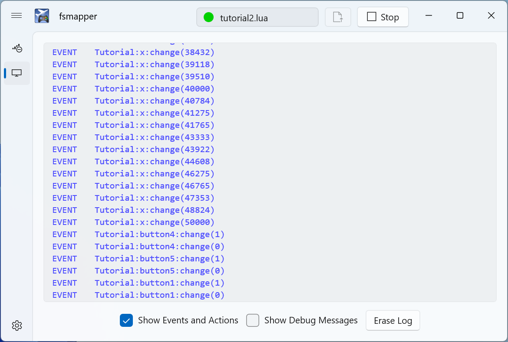

# Tutorial
fsmapper offers various functionalities to enhance the flight simulation experience. It allows users to configure these functions flexibly to suit their own equipment and the aircraft they are piloting.
Actually, this flexibility comes from fsmapper's configuration being written in Lua scripts. Therefore, to use fsmapper, one must first write Lua scripts.


In this page, examples of configuration scripts for some fsmapper's functionalities will be introduced, 
offering an understanding of the essentials of configuration scripts. 
After grasping these aspects in this tutorial, please refer to the [**Configuration Guide**](/category/configuration-guide) and the [**Library Reference**](/libs) to create tailored configuration scripts for your environment.

:::info
The illustrated Lua scripts in this tutorial are located under ```samples\tutorials\``` within the fsmapper installation folder.
:::

:::warning Lua not covered
The intended readers of this document are beginners with fsmapper but have experience using Lua script language. 
This document does not provide an explanation of the Lua script language. <br/>
Please refer to the [**Lua 5.4 Reference Manual**](https://www.lua.org/manual/5.4/) or [**related literatures**](https://www.lua.org/pil/) for information on Lua script language.
:::

## Your first configuration file
The most critical concept in writing fsmapper's configuration files is its event-driven behavior.
When events occur, such as pressing a button on a flight stick, tapping on a virtual instrument panel, or the caution light in the aircraft illuminating, you describe in Lua scripts what actions to take in response to those events.<br/>
By registering the relationship between events and actions as a table in a format called **Event-Action mapping definition**, the system triggers the actions appropriately at the right timing.

So, let's take a look at the first script example then.

```lua {3-11} title="tutorial1.lua" showLineNumbers
local my_event = mapper.register_event('My Event')
mapper.set_primary_mappings{
    {
        event = my_event,
        action = function (evid, value)
            mapper.print('Value: ' .. value)
            mapper.delay(2000, function ()
                mapper.raise_event(my_event, value + 1)
            end)
        end
    }
}
mapper.raise_event(my_event, 1)
```

The highlighted portion (lines 3 to 11) represents the **Event-Action mapping definition**.
In this example, the script registers an event named **'My Event'** using [```mapper.register_event()```](/libs/mapper/mapper_register_event), 
sets actions for that event using [```mapper.set_primary_mappings()```](/libs/mapper/mapper_set_primary_mappings), 
and finally triggers the **'My Event'** event with [```mapper.raise_event()```](/libs/mapper/mapper_raise_event).

As evident from the arguments of [```mapper.raise_event()```](/libs/mapper/mapper_raise_event) and the arguments of registered function acting as action, each event carries an associated value. 
While the type of value varies for each event, there are no system constraints on these values. 
Any object expressible in Lua can be set as the associated value for an event.<br/>
In this script, the initial **'My Event'** raised is associated with the numeric value 1. 
The function registered as an action prints the associated value to console with [```mapper.print()```](/libs/mapper/mapper_print),then raises a **'My Event'** event with the value of the received event plus 1, after a delay of 2000 milliseconds by using [```mapper.delay()```](/libs/mapper/mapper_delay).

## Start App to Observe events
Let's run ```fsmapper.exe```. <br/>
If it's your first time running fsmapper, a file selection dialog will appear. Please specify the aforementioned script ```tutlial1.lua```. If the dialog doesn't appear, press the **[Stop]** button in the top right to halt the script, then use the adjacent button to display the file selection dialog.

After you successfully select ```tutorial1.lua```, select the **Message Console** from the left navigation pane to display the message console. You'll notice that the value associated with the 'My Event' event is incremented and displayed at two second intervals, similar to the image below.


Next, let's explore the functionality of the message console a bit further. 
In this script, the contents of the message were displayed in the console within the action.
However, observing the events that occur can be made even simpler.

Enable the **[Show Events and Actions]** checkbox at the bottom of the window.
This will display the events that occurred along with their associated values in blue, as shown in the image below.


## Handle an input device
```tutorial1.lua``` was essentially a script that did nothing, but this time, let's explore meaningful examples that handle input devices like flight sticks or gamepads.

```lua {4} title="tutorial2.lua" showLineNumbers
device = mapper.device{
    name = 'Tutorial',
    type = 'dinput',
    identifier = {index = 1},
    modifiers = {},
}
```

[```mapper.device()```](/libs/mapper/mapper_device) is a function that opens the device and returns a [```Device```](/libs/mapper/Device) object. <br/>
The ```name``` parameter is the user-assigned name, used for display in the dashboard or message console. Please assign an appropriate name.<br/>
The ```type``` parameter specifies the type of device to open, ```'dinput'``` refers to gaming devices supported by DirectInput.<br/>
The ```Identifier``` parameter specifies a table representing information to identify the device, but the table format varies by a device type.<br/>

In this example, ```{index = 1}``` is specified for the ```identifier``` parameter, indicating the first device in the list of DirectInput gaming devices managed internally by Windows.<br/>
While this works, it's not recommended. Reordering due to connecting or disconnecting other devices may change the device position in the list. 
This setting is chosen for a tutorial script as a default to prevent errors in any environment, but it's advisable to specify the **product name** or **GUID** for the identifier, tailored to the device you want to use.

How can one obtain the product names or GUIDs of each DirectInput gaming device? Actually, fsmapper can assist with this task. Try checking **[Show Debug Messages]** on the **Message Console** page and then restart the script. You'll see messages displayed like the following.


As you can see, the product names are displayed on the right, and the GUIDs are displayed on the left for all connected DirectInput gaming devices on the PC.

To open the X-56 throttle specifying the product name, you would set the ```identifier``` parameter like this.

```lua
identifier = {name = 'Site Pro Flight X-56 Rhino Throttle'}
```

For specifying the GUID, you would do it like this.

```lua
identifier = {guid = '{5EBE42D0-837D-11EB-8002-44455354000}'}
```

Let's execute the script with fsmapper since it has been correctly written. 
Check **[Show Events and Actions]** in the message console and then manipulate the gaming device.



You would have observed the name of each button and analog axis and noticed the change in values as events when manipulated. <br/>
Buttons are represented by binary values of 0 or 1. Analog axes are normalized from -50,000 to 50,000 regardless of the device's resolution. Additionally, POV is represented by degrees from 0 to 360 for direction.

At the end of the tutorial on handling input devices, let's briefly touch upon one crucial concept: [**Event Modifier**](/guide/device#event-modifier).
So far, all the events from the devices you've seen have been associated with a numerical value under the name ```change```. With [**Event Modifier**](/guide/device#event-modifier), you can alter the type of events that occur and their timing.<br/>
As an example, modify the ```modifiers``` parameter in ```tutorial2.lua``` as follows.

```lua
modifiers = {
    {class = 'binary', modtype = 'button'},
}
```

The ```class = 'binary'``` means targeting all binary-type device units such as general buttons or switches as event modifiers. 
You can also specify individual device units by using the ```name``` parameter, like ```name = 'button1'```, instead of the ```class``` parameter. 
The ```modtype = 'button'``` represents the type of event modifier and, in this case, performs convenient conversions for handling device units like buttons.

Execute the modified script and observe the events to see what occurs.


As shown in the image above, the events for analog axes are unchanged, while events for buttons are no longer labeled as ```change```. 
Instead, there are two types of events triggered: ```down``` when the button is pressed and ```up``` when it's released.

This distinction between the two events eliminates the need to explicitly handle value differences in the actions. 
It allows for concise definitions within the Event-Action mapping, reducing CPU load. 
Additionally, the ```button``` event modifier option enables the generation of events for actions like double clicks or long presses.

## Interact with FS2020

This section marks the end of the tutorial. Let's finally control an aircraft in Microsoft Flight Simulator.
The goal is to register the following two Event-Action mappings.

- Toggle the **landing light switch** according to the press of **button1** on the gaming device.
- Toggle the **strobe light switch** according to the press of **button2** on the gaming device.

Append the highlighted portion of the following script from line 9 onwards to the script created in the previous section.

```lua {9-22} title="tutorial3.lua" showLineNumbers
device = mapper.device{
    name = 'Tutorial',
    type = 'dinput',
    identifier = {index = 1},　-- Shoud be modified this line to suit your environment
    modifiers = {
        {class = 'binary', modtype = 'button'},
    }
}
local events = device:get_events()

mapper.set_primary_mappings{
    {
        event = events.button1.down,
        action = function ()
            fs2020.mfwasm.execute_rpn('0 (A:LIGHT LANDING:0, Bool) ! (>K:2:LANDING_LIGHTS_SET)')
        end
    },
    {
        event = events.button2.down,
        action = fs2020.mfwasm.rpn_executer('0 (A:LIGHT STROBE:0, Bool) ! (>K:2:STROBES_SET)')
    },
}
```

:::warning note
This script may function with many of Asobo's default small aircraft, but it might not work with aircraft that have three-state light switches or third-party add-on aircraft.
:::

The added initial line retrieves a table containing event IDs according to each device unit's events using the [```get_events()```](/libs/mapper/Device/Device-get_events) method of the [```Device```](/libs/mapper/Device) object.

In the two Event-Action mappings, cockpit devices are manipulated by executing [**RPN script**](https://docs.flightsimulator.com/html/Additional_Information/Reverse_Polish_Notation.htm). In MSFS, [**RPN script**](https://docs.flightsimulator.com/html/Additional_Information/Reverse_Polish_Notation.htm) serve as one of the most versatile means of interaction.

You might notice a slight difference in the descriptions of the two actions. The action for ```button1``` registers a Lua function as an action, similar to ```tutorial1.lua```. Within that function, it calls [```fs2020.execute_rpn()```](/libs/fs2020/fs2020_mfwasm_execute_rpn) to execute the RPN script.

The action for ```button2``` doesn't register a Lua function but instead registers an object returned by [```fs2020.rpn_executer()```](/libs/fs2020/fs2020_mfwasm_rpn_executer). This function returns a specific type of fsmapper object called a [**Native-action**](/guide/event-action-mapping#action). Native-action objects are implemented in precompiled native code by fsmapper, can be registered as actions, and can be executed with lower overhead compared to Lua functions.

Apart from RPN execution, fsmapper offers several [**Native-actions**](/guide/event-action-mapping#action).

:::tip
How can one find the RPN that corresponds to the operation of each object in the cockpit?
Some considerate developers document like [**this information**](https://docs.flybywiresim.com/fbw-a32nx/a32nx-api/a32nx-flightdeck-api/), making it a good reference point.

Unfortunately, many addon aircraft lack such documentation, including default aircraft. However, Microsoft provides useful tools for developers, making it relatively easy to gather hints for writing RPN scripts.<br/>
Enabling Developer Mode and displaying the [**Behavior Debug**](https://docs.flightsimulator.com/html/Developer_Mode/Menus/Tools/Behaviors_Debug.htm) window allows you to explore the [```<Behaviors>``` definitions of an aircraft's interior model XML file](https://docs.flightsimulator.com/html/Content_Configuration/Models/ModelBehaviors/Model_Behaviors.htm) more easily.

This image illustrates referencing the Landing Light definition from the [**Model Behavior**](https://docs.flightsimulator.com/html/Content_Configuration/Models/ModelBehaviors/Model_Behaviors.htm) within the Extra 330's interior model, demonstrating how to find the information underlying the above RPN.


:::