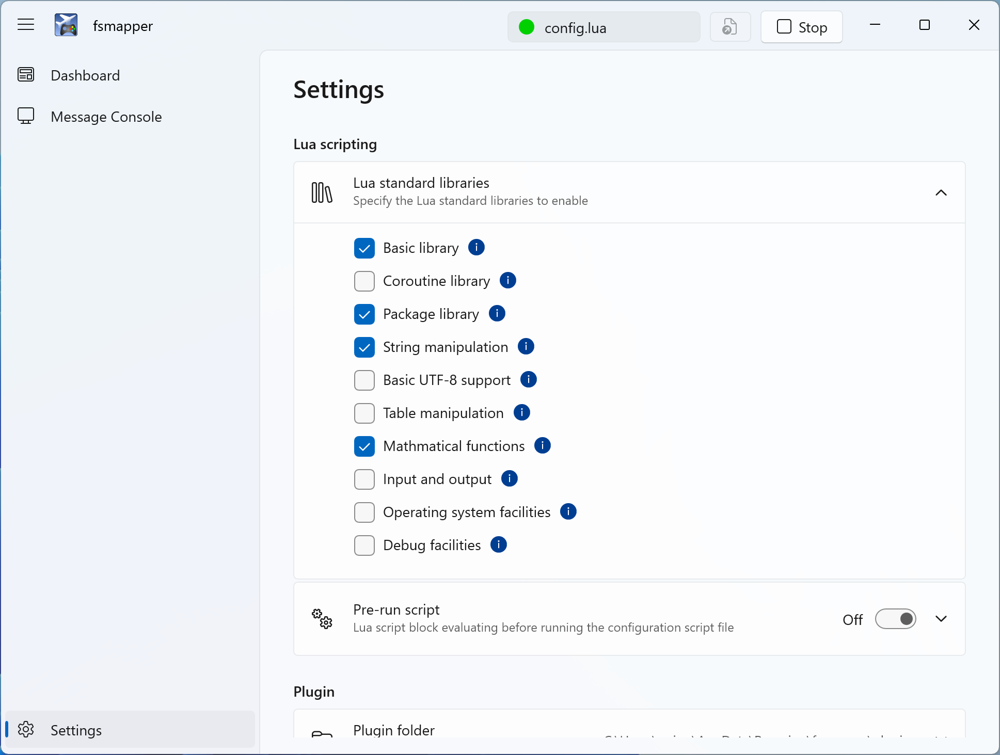

# Lua in fsmapper

fsmapper incorporates a Lua script interpreter. 
This section provides Lua-related information necessary for writing Lua scripts as configuration files for fsmapper. 
However, it does not delve into the specifics of Lua language usage, so please refer to the [**Lua 5.4 Reference Manual**](https://www.lua.org/manual/5.4/) for details on Lua itself.

## Lua Version
|Verion|
|------|
|5.4.8 |

## Available Lua Standard Libraries

The following libraries from the Lua standard library are enabled by default.

|Name| Description|
|----|------------|
|[basic](https://www.lua.org/manual/5.4/manual.html#6.1)|Basic functions|
|[package](https://www.lua.org/manual/5.4/manual.html#6.3)|Basic facilities for loading modules|
|[string](https://www.lua.org/manual/5.4/manual.html#6.4)|String manipulation|
|[table](https://www.lua.org/manual/5.4/manual.html#6.6)|Table manipulation|
|[math](https://www.lua.org/manual/5.4/manual.html#6.7)|Mathematical functions|

If you want to use libraries other than those listed above in the configuration file or if you want to disable certain libraries for memory working set efficiency, you can change these settings on the settings page from the default configuration.



## Module Search Path

Lua scripts in fsmapper can load Lua modules and Lua C modules using [`require()`](https://www.lua.org/manual/5.4/manual.html#pdf-require).
Which modules can be found by [`require()`](https://www.lua.org/manual/5.4/manual.html#pdf-require) is determined by Lua's module search path.

### Default Search Path in fsmapper

When fsmapper starts, it initializes the following Lua variables:

- [`package.path`](https://www.lua.org/manual/5.4/manual.html#pdf-package.path): Paths used to search for pure Lua modules (.lua files).

- [`package.cpath`](https://www.lua.org/manual/5.4/manual.html#pdf-package.cpath): Paths used to search for compiled native libraries (.dll files).

These search paths are configured so that Lua modules and Lua C modules can be loaded
**relative to the directory where the user-specified Lua script is located**.

As a result, Lua files and Lua C modules placed in the same directory as the script,
or in its subdirectories, can be loaded with [`require()`](https://www.lua.org/manual/5.4/manual.html#pdf-require) without any additional configuration.

```lua
-- mymodule.lua is located in the same directory as the script
local mymodule = require("mymodule")
```

Lua C modules are handled in the same way and are also searched relative to the script location.

### Loading Modules from Other Locations
If you want to load modules located outside the script directory,
you must explicitly modify the module search path within your Lua script.

This behavior is not specific to fsmapper, but follows standard Lua semantics.

```lua
-- Add a search path for Lua modules
package.path = package.path .. ";/path/to/lua/modules/?.lua"

-- Add a search path for Lua C modules
package.cpath = package.cpath .. ";/path/to/lua/modules/?.dll"
```

After updating these paths, modules in the specified directories can be loaded using [`require()`](https://www.lua.org/manual/5.4/manual.html#pdf-require).

:::info note
fsmapper exposes directory path variables such as [`mapper.script_dir`](/libs/mapper/mapper_script_dir/),
[`mapper.profile_dir`](/libs/mapper/mapper_profile_dir/), and [`mapper.saved_games_dir`](/libs/mapper/mapper_saved_games_dir/).

These variables can be used when extending [`package.path`](https://www.lua.org/manual/5.4/manual.html#pdf-package.path) or [`package.cpath`](https://www.lua.org/manual/5.4/manual.html#pdf-package.cpath),
for example:

```lua
package.path = package.path .. ";" .. mapper.script_dir .. "/modules/?.lua"
```
Using these variables helps avoid hard-coded paths and improves portability
of Lua scripts across different environments.
:::