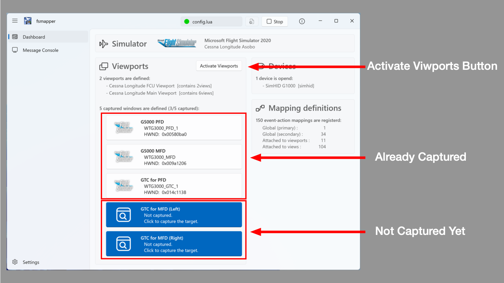

# Virtual Instrument Panel

fsmapper provides the capability to flexibly construct a virtual instrument panel on a sub display.
When combined with a touchscreen-enabled display, it allows for a diverse range of aircraft controls beyond what can be achieved with your physical input devices alone. 
This functionality is particularly designed with the following aspects in mind.

- Ability to seamlessly integrate FS2020 instrument windows that are popped out using **`[Right Alt]`** + **`[Mouse Click]`** as part of the virtual instrument panel with a natural appearance.

- Not only does it have the capability to display and interact with different virtual instrument panels for each aircraft, but it also allows for dynamically switching between multiple panels within a single aircraft.

These features enable the utilization of smaller screens, such as tablets, without the necessity for large secondary monitors (like this [video](https://www.youtube.com/watch?v=oaI1DVXfHqY)).

:::note
The motivation and drive behind creating fsmapper was precisely to achieve this feature.<br/>
Towards the end of 2020, when I decided to DIY [this device](https://github.com/opiopan/simhid-g1000) for FS2020, I started researching which software would be most suitable for controlling the display. 
Unfortunately, I couldn't find any software capable of this at the time.

Ultimately, this led to the decision to DIY the software as well.
:::

## Components for Virtual Instrument Panel

The virtual instrument panel comprises a combination of three hierarchical objects:

- **Viewport:**<br/>
    Represents the rectangular area in the screen space of the Windows where the virtual instrument panel is displayed. It's practically a transparent [**Layered Window**](https://learn.microsoft.com/en-us/windows/win32/winmsg/window-features#layered-windows) placed within this rectangular area.

- **View:**<br/>
    Holds the content displayed on the **Viewport** and handles touch interactions. Multiple **View**s can belong to a **Viewport**, but only one of them is displayed or receives touch events, referred to as the **current View**.

- **View Element:**<br/>
    A sub-component of the **View**, designed to simplify the rendering process and touch interactions. The FS2020 instrument window that pops out with **`[Right Alt]`** + **`[Mouse Click]`** can also serve as a **View Element** within the configuration of the **View**.

As an example, in [this sample script](/samples/a32nx), the relationships between each object will be explained.


This script divides the entire sub-display into three viewports.<br/>
Viewport 3 has only one view and acts as an indicator showing which view the other two viewports are displaying.<br/>
Viewport 1 and Viewport 2 each contain five views with FS2020's pop-out instrument windows for six displays of the A320 (FCU, PFD, ND, ECAM x 2, MCDU).
Users can freely switch between the content of these two views.<br/>

In this way, combining viewports and views allows for the creation of a flexible instrument panel.

Let's now see how each view combines view elements to form its composition.


View elements consist of three types: 
the [`OperableArea`](/libs/mapper/OperableArea) object, indicating touch-operable regions; 
the [`Canvas`](/libs/mapper/Canvas) object, delineating drawable areas and holding rendering logic; 
and the [`CapturedWindow`](/libs/mapper/CapturedWindow) object, treating windows from other processes, like FS2020's pop-out instruments, as view elements.

Given that operational changes often reflect visually, such as indicator lamps on buttons, [`OperableArea`](/libs/mapper/OperableArea) and [`Canvas`](/libs/mapper/Canvas) commonly overlap as illustrated above.

Please focus on the upper ECAM display placed in the view as a [`CapturedWindow`](/libs/mapper/CapturedWindow). 
Notice that unlike when popping out a window in FS2020, the title bar and window frame are hidden, seamlessly integrating into the instrument panel.
This illustrates how fsmapper actively manages the state of windows from other processes, captured as CapturedWindows, enhancing their utility as components within the view.

:::info
fsmapper utilizes a [**WH_CALLWNDPROC** global hook](https://learn.microsoft.com/en-us/windows/win32/winmsg/about-hooks#wh_callwndproc-and-wh_callwndprocret) to perform DLL injection into processes like fs2020.
This hook enables the replacement of message response processing, alongside [hooking certain Win32 APIs](https://github.com/opiopan/fsmapper/blob/v0.9.1/src/hook/hookdll.cpp#L339-L340), facilitating control over portions of the view and managing visibility in coordination with view switching.

It seems that FS2020's pop-out windows require this special treatment; otherwise, it's not possible to control the appearance, position, and size of the window as intended without these measures.
:::

The conceptual explanation of **Viewport**, **View**, and **View Elements** concludes here, and the explanation will now focus on how to define them in Lua scripts.

### Viewport
The definition of a **Viewport** is accomplished by creating a [`Viewport`](/libs/mapper/Viewport) object using [`mapper.viewport()`](/libs/mapper/mapper_viewport). 
At this point, the crucial parameter is the information regarding which area of the screen it occupies, specified by the display number and additional information,　and there are several ways to define it as follows.

```lua
-- Viewport that covers the entire the display 2
local viewport1 = mapper.viewport{
    name = 'Viewport 1',
    diplayno = 2,
}

-- Relative specification:
-- Viewport that occupies the right half of the display 3
local viewport2 = mapper.viewport{
    name = 'Viewport 2'
    diplayno = 3,
    x = 0.5, y = 0,
    width = 0.5, y = 1,
}

-- Pixel-based specification: 
-- Viewport that occupies a 100px x 100px area at the top-left of the display 3
local viewport3 = mapper.viewport{
    name = 'Viewport 3'
    diplayno = 3,
    coordinate = 'absolute',
    x = 0, y = 0,
    width = 100, y = 100,
}
```

Defining the viewport alone doesn't make it effective. Once all viewport definitions that constitute the virtual instrument panel are completed, you activate them with [`mapper.start_viewports()`](/libs/mapper/mapper_start_viewports).


```lua
mapper.start_viewports()
```

Once you invoke [`mapper.start_viewports()`](/libs/mapper/mapper_start_viewports), you can't define new viewports. If you want to display another virtual instrument panel, call [`mapper.reset_viewports()`](/libs/mapper/mapper_reset_viewports) to remove all defined viewports.

```lua
mapper.reset_viewports()
```

### View Element
The creation of [`OperableArea`](/libs/mapper/OperableArea) objects is done using [`mapper.view_elements.operable_area()`](/libs/mapper/mapper_view_elements_operable_area).
The parameters involve specifying the type of corresponding touch action and the [**Event ID**](/guide/event-action-mapping#event) that triggers when that action is detected. Further details are explained in the [**Handle Touch Event**](#handle-touch-event).

```lua
local tapped = mapper.register_event('tapped on the view')
local operable_area = mapper.view_elements.operable_area{event_tap = tapped}
```

The creation of [`Canvas`](/libs/mapper/Canvas) objects is done using [`mapper.view_elements.canvas()`](/libs/mapper/mapper_view_elements_canvas).
The crucial parameters include the rendering function (`renderer`) responsible for the drawing process and the initial value of the user-defined context that determines the drawing content (`value`).
Further details are explained in the [**Render on the View**](#render-on-the-view).

```lua
local canvas = mapper.view_elements.canvas{
    value = true,
    renderer = function (rctx, value)
        -- Here is the drawing code
    end
}
```

The creation of [`CapturedWindow`](/libs/mapper/CapturedWindow) objects is done using [`mapper.view_elements.captured_window()`](/libs/mapper/mapper_view_elements_captured_window).
The parameters involve specifying the name displayed on the dashboard and the title text of the window to capture. 
Refer to the [**Handle Popped-out Windows**](#handle-poped-out-windows) for related information.

```lua
local captured_window = mapper.view_elements.captured_window{
    name = "G1000 PFD",
    window_title="AS1000_PFD"
}
```
### View
**Views** are defined using the [`register_view()`](/libs/mapper/Viewport/Viewport-register_view) method of the [`Viewport`](/libs/mapper/Viewport) object. Parameters include the name of the view (`name`), a list of view elements comprising the view (`elements`), and associated [**Event-Action mappings**](/guide/event-action-mapping) for the view (`mappings`). Often, a background image (`background`) is specified as the base for the view.

```lua
local view_id = viewport3:register_view{
    name = 'my_view',
    background = graphics.bitmap('assets/view3.png'),
    elements = {
        {object=operable_area, x=0, y=0, width=100, height=50},
        {object=canvas, x=0, y=0, width=100, height=50},
        {object=captured_window, x=0, y=50, width=100, height=50},
    },
    mappings = {{event=tapped, action = fs2020.rpn_executer('(>K:XPNDR_IDENT_ON)')}}
}
```

[`Viewport:register_view()`](/libs/mapper/Viewport/Viewport-register_view) returns a unique identifier for the view known as the **View ID**.
When registering multiple views within a viewport, it's essential to keep track of the **View ID** for each view.
To change the current view within the viewport, set the **View ID** to the [`current_view`](/libs/mapper/Viewport/Viewport_current_view) property of the [`Viewport`](/libs/mapper/Viewport) object or use the [`change_view()`](/libs/mapper/Viewport/Viewport-change_view) method.

```lua
viewport.current_view = view_ids[2]
```

## Coordinate System
In this section, there is an explanation provided regarding the knowledge of coordinate systems that users need to be mindful of when constructing a virtual instrument panel.

The positions and lengths specified during the definitions and operations of [**Viewport**](#viewport), [**View**](#view), and [**Canvas**](/libs/mapper/Canvas) follow distinct coordinate systems.
Each coordinate system is a two-dimensional Cartesian coordinate system, and the directions of the x-axis and y-axis are the same for each coordinate system.
However, each coordinate system may have its own origin and unit length.

In fsmapper, users can define coordinate systems for each space with a nested structure, as follows.

- **Display Space:**<br/>
    The coordinate system of the display space where viewports are located can use a different coordinate system than the Windows system, defined during [**Viewport**](#viewport) definition.
    This coordinate system affects the position and size of the viewport specified during its definition in [`mapper.viewport()`](/libs/mapper/mapper_viewport), impacting how the parameters `x`, `y`, `width`, and `height` are interpreted.

- **Viewport's Active Area**<br/>
    During [**Viewport**](#viewport) definition, it is possible to set the aspect ratio of the effective display area to a different value than the overall aspect ratio of the viewport.
    This actually displayable area is referred to as the Viewport's active area.<br/>
    Keep in mind that there are no operations to specify the size or coordinates for the viewport's active area coordinate system.
    However, it is inherited as the default coordinate system for each view belonging to the viewport.

- **View Space:**<br/>
    The coordinate system of the view space is determined during [**View**](#view) definition and affects the positions and sizes of each view element within the view. 
    The interpretation of parameters `x`, `y`, `width`, and `height` of each element in the array specified in [`Viewport:register_view()`](/libs/mapper/Viewport/viewport-register_view) is interpreted by this coordinate system.

- **Canvas Space:**<br/>
    The coordinate system of th canvas is determined during [**Canvas**](/libs/mapper/canvas) object [creation](#view-element) and affects general drawing operations on the canvas. The meaning of parameters specifying the position and length in each [rendering context's methods](/libs/graphics/RenderingContext#methods) passed as arguments to the [renderer](/libs/mapper/RENDER) is determined by this coordinate system.

The specifics of how these coordinate systems are determined will be explained further in subsequent sections.

### Origin and Direction of each Axis
Each coordinate system considers the top-left corner of the space as the origin point. 
The x-axis extends from left to right, while the y-axis extends from top to bottom within each respective space.

### Relative Coordinates vs. Absolute Coordinates
Each spatial coordinate system can be either a **relative** or **absolute** coordinate system.
In fsmapper, these terms differ from their common mathematical and computer science definitions.

The **relative coordinate system** expresses coordinates as normalized values within a space with a width and height set to 1.
For instance, `(0.5, 0.5)` denotes the center of the space. Normalizing the width and height to 1 doesn't necessarily equate to equal lengths along the x and y axes.
In other words, it means that on the display, the lengths of the vectors `(0.1, 0)` and `(0, 0.1)` might not be equal.

The **absolute coordinate system** defines coordinates based on a unit length in both the x and y axes.
In this case, the lengths of the vectors `(1, 0)` and `(0, 1)` on the display are always the same.
Users can freely define this unit length for coordinate systems outside of the display space. 
When an absolute coordinate system is chosen for the display space, pixels become the unit length.

The method for specifying which coordinate system type to use varies significantly between display space and others.

- **Display Space:**<br/>
    By default, the coordinate system chosen during viewport definition is the relative coordinate system.
    Only when specifying `'absolute'` in the `coordinate` parameter of [`mapper.viewport()`](/libs/mapper/mapper_viewport) does it become an absolute coordinate system.
    As mentioned earlier, selecting the absolute coordinate system means that the values specified for `x`, `y`, `width`, and `height` parameters are in pixel units.

- **Viwport's Active Area, View Space, Canvas Space:**<br/>
    The default coordinate system type is inherited from the parent space.
    If the parent space is in absolute coordinate system, the unit length will also be the same as the parent space's coordinate system.<br/>

    When defining each space, i.e., when calling [`mapper.viewport()`](/libs/mapper/mapper_viewport), [`Viewport:register_view()`](/libs/mapper/Viewport/Viewport-register_view), and [`mapper.view_elements.canvas()`](/libs/mapper/mapper_view_elements_canvas), you can redefine the coordinate system of each space by specifying certain parameters.
    For choosing the absolute coordinate system, use the `logical_width` and `logical_height` parameters to specify the width and height as multiples of the unit length.
    For choosing the relative coordinate system, use the `aspect_ratio` parameter to specify the aspect ratio of the space.

    Note that both specifications allow for different aspect ratios compared to the parent space. For more details, refer to the [**Alignment**](#allignment) section.

### Allignment
As mentioned earlier, the aspect ratio of the viewport's active area, view, and canvas can be chosen to be different from the aspect ratio at the time of their placeholder definition.
For instance, when defining a viewport to occupy the entire 16:9 display but intending to display a view designed with a 4:3 aspect ratio for a virtual instrument panel, situations like these emerge.

Placeholder for each object and the functions it defines are shown below.

|Object|Placefolder|Function to be defined|
|---|---|---|
|Viewport's active area|Viewport|[`mapper.viewport()`](/libs/mapper/mapper_viewport)
|View|Viewport's active area|[`mapper.viewport()`](/libs/mapper/mapper_viewport)
|Canvas|View element region|[`Viewport:register_view()`](/libs/mapper/Viewport/Viewport-register_view)

When specifying different aspect ratios, the positioning of the object can be defined using the following parameters at the time of each object definition.

|Key|Type|Description|
|---|----|-----------|
|`horizontal_alignment`|string|The horizontal alignment rule, specifying either `'center'`, `'right'`, or `'left'`.<br/>The default is `'center'`.
|`vertical_alignment`|string|The vertical alignment rule, specifying either `'center'`, `'top'`, or `'bottom'`.<br/>The default is `'center'`.

For scenarios like dividing the display into multiple viewports, as demonstrated in the [**Components for Virtual Instrument Panel**](#components-for-virtual-instrument-panel) example, setting alignment in this way ensures a natural display even if the display's aspect ratio changes.

```lua {7,16}
viweport_l = mapper.viewport{
    name = 'Left Viewport',
    displayno = 2,
    x = 0, y = 0,
    width = 0.5, height = 1,
    aspect_ratio = 2/3,
    horizontal_alignment = 'right',
}

viweport_r= mapper.viewport{
    name = 'Right Viewport',
    displayno = 2,
    x = 0.5, y = 0,
    width = 0.5, height = 1,
    aspect_ratio = 2/3,
    horizontal_alignment = 'left',
}
```

## Z-order
The z-order of objects related to the display content of a view is presented here. It indicates the sequence in which objects are displayed when they overlap, determining which object is brought to the foreground.

Objects related to the view's display consist of three types: [`Canvas`](/libs/mapper/Canvas) view elements, [`CapturedWindow`](/libs/mapper/CapturedWindow) view elements, and the [background image of the view](#view).
These three types of objects have a defined order, and they are rendered from the foreground in the following sequence.

1. Canvas view elements
2. Background image of the view
3. CapturedWindow view elements

The ordering of same types of view elements reflects the sequence specified in the `elements` parameter during [view definition](#view).
The element positioned at the beginning of the array appears in the forefront of the view.

:::warning Note
Please note that the CapturedWindow view element appears behind the view's background image. Adjust the alpha value to a lower setting for the area corresponding to the placement of the CapturedWindow within the view's background image to ensure transparency for the underlying CapturedWindow. <br/>
Especially for CapturedWindows targeting pop-out instrument windows in FS2020 with touch panel functionality such as Garmin G3X, an alpha value of 0 is necessary. As per Windows specifications, if a Layered Window has an alpha value other than 0 in the foreground, it won't receive touch or mouse-related messages.
:::

## Render on the View
Rendering methods for the view come in two forms.
One involves setting a static image as the background image during [View definition](#view).
The other method involves defining a [`Canvas`](/libs/mapper/Canvas) view element to dynamically update specific areas.

As mentioned earlier, each [`Canvas`](/libs/mapper/Canvas) object holds a [`value`](/libs/mapper/Canvas/Canvas_value) property designed to maintain the context of the target for rendering. Updating the Canvas's area on the view is achieved by updating this [`value`](/libs/mapper/Canvas/Canvas_value) property. Upon updating the [`value`](/libs/mapper/Canvas/Canvas_value) property, fsmapper invokes the registered [renderer](/libs/mapper/RENDER) for the Canvas at the appropriate timing.

```lua title="Renderer Definition"
function render(rendering_context, value)
```

The [renderer](/libs/mapper/RENDER) receives two arguments: the rendering context adjusted to the Canvas's coordinate system, serving as the output target for the Canvas-associated view, and the `value` property. Typically, the operation of renderer involves invoking rendering context methods based on the `value` to draw on the view.

Below is an example of a renderer that holds the aircraft's heading as the `value` and draws the heading indicator needle.

```lua
-- Load the bitmap of needle then change the origin to the pivot
local needle = graphics.bitmap('assets/hi_needle.png')
needle:set_origin(5, 50)

-- Define a canvas to render the needle
local needle_canvas = mapper.canvas{
    local_width = 100, local_height = 100,
    value = 0,
    renderer = function (rctx, value)
        rctx:draw_bitmap{bitmap=needle, x=50, y=50, rotation=value}
    end
}
```

The canvas above gets updated synchronously with the change in the aircraft's heading through the following Event-Action mapping.

```lua
-- Register an RPN to monitor the heading of the aircraft
local hdg_change = mapper.register_event('HDG')
fs2020.add_observed_data{
    {
        event = hdg_change,
        rpn = '360 (A:HEADING INDICATOR, Degrees) -',
        epsilon = 0.5,
    }
}

-- Register Event-Action mappiing to update the canvas
mapper.add_global_mappings{
    {event=hdg_change, action=needle_canvas:value_setter()}
}
```

:::info Note
The comprehensive overview of the graphics rendering capabilities offered by fsmapper can be found under the [**Graphics**](/guide/graphics).
:::

## Handle Touch Event
As explained in the [**View Element**](#view-element), to handle touch interactions on the view, you need to place OperableArea view elements within the view to trigger events corresponding to touch actions.
For each OperableArea object, you can individually set the types of touch actions to recognize.
This is determined by the parameters you specify in [`mapper.view_elements.operable_area()`](/libs/mapper/mapper_view_elements_operable_area).

Please specify the event ID corresponding to the supported action alongside the parameter for the action you want to support when detected.

|Key|Type|Description|
|---|----|-----------|
|event_tap|numeric|Specify the Event ID to be triggered upon detecting a tap action
|event_flick_up|numeric|Specify the Event ID to be triggered upon detecting an upward flick action
|event_flick_down|numeric|Specify the Event ID to be triggered upon detecting a downward flick action
|event_flick_right|numeric|Specify the Event ID to be triggered upon detecting a rightward flick action
|event_flick_left|numeric|Specify the Event ID to be triggered upon detecting a leftward flick action
|event_rotate_clockwise|numeric|**CURRENTRY NOT IMPLEMENTED**
|event_rotate__counterclockwise|numeric|**CURRENTRY NOT IMPLEMENTED**

## Handle Poped out Windows
For integrating FS2020's popped-out instrument windows into the virtual instrument window, define a [`CapturedWindow`](/libs/mapper/CapturedWindow) view element corresponding to the area where the popped-out window should be placed.
If a [**Viewport**](#viewport) containing a [**View**](#view) with [`CapturedWindow`](/libs/mapper/CapturedWindow) placements is present, calling [`mapper.start_viewports()`](/libs/mapper/mapper_start_viewports) won’t immediately display the view. Instead, a list of defined [`CapturedWindow`](/libs/mapper/CapturedWindow) elements will appear on the left side of the dashboard as shown below.




This area will display the text specified in the `name` parameter during the [`CapturedWindow`](/libs/mapper/CapturedWindow) definition. It should clearly convey to users the instruments that need to be popped out.
Use this guide to sequentially pop out the necessary instruments by pressing `Right-Ctrl` + `Mouse Click`.

As explained in the [**View Element**](#view-element) section, if you specify the window title text using the `window_title` parameter, fsmapper will automatically capture it. 
Windows captured by fsmapper become hidden from the screen, and the `name` texts at the top three of the list in the above image turn blue.
When all the windows targeted by CapturedWindows are captured, the views registered in the viewports will be displayed.

When the `window_title` parameter is not specified during the definition of a [`CapturedWindow`](/libs/mapper/CapturedWindow) or if the specified text is not correct, resulting in the automatic capture of the window not happening, you need to explicitly indicate the window corresponding to the [`CapturedWindow`](/libs/mapper/CapturedWindow) element.

The [`CapturedWindow`](/libs/mapper/CapturedWindow) elements listed on the dashboard are buttons. Clicking on a button transitions to a mode to select a window. Use the mouse to click on the corresponding instrument window. When the instrument window is captured, the appearance of the button will also change.

In the case of manually capturing a window, remember to click the `Activate Viewports` button last.
This action enables the defined viewports and displays the views registered to the viewports.

### Avoiding touch problems of FS2020
It is well known that the popped out window of an instrument with touch operable capability, such as Garmin G3X, doesn't work well with touch operation, even though it works with mouse operation. <br/>
fsmapper provides a workaround solution for this problem. 
You will be able to operate popped out windows with touch operation if those windows are managed as CapturedWindow view elements.

If you want to stop this workaround, specify the value as false for `avoid_touch_problems` parameter of [`mapper.view_elements.captured_window()`](/libs/mapper/mapper_view_elements_captured_window).

:::info Note
I don't know the true reason why touch operations are ignored by FS2020. However I assume that this problem is caused by the mechanism to recognize the mouse status change.

I assume that FS2020 polls the current mouse status periodically by using DirectInput API instead of handling the windows message stream such as `WM_LBUTTON_DOWN`. This method may drop some status change events when multiple events occur in a time shorter than the polling interval.<br/>
Mouse messages generated as a result of tapping are exactly this situation.
To avoid noise such as palm contacts, Windows delays touch related messages when first contact is recognized. As a result, `WM_LBUTTON_DOWN` and `WM_LBUTTON_UP` messages will occur at the almost same time when you tap a display. In this case, FS2020 cannot recognize mouse button state changes.

Based on this hypothesis, fsmapper removes mouse events generated as a result of a touch operation from the mouse event queue. on the other hand, fsmapper generates mouse events with appropriate intervals.
:::

## Hiding Viewport
Each [**Viewport**](#viewport) holds a system defined view called [`empty_view`](/libs/mapper/Viewport/viewport_empty_view). 
This special view doesn’t contain any view elements or background images, in other words, it’s transparent and doesn’t interfere with interactions on the underlying windows.

To hide a viewport, set [`empty_view`](/libs/mapper/Viewport/viewport_empty_view) as the current view.

```lua
my_viewport:change_view(my_viewport.empty_view)
```
