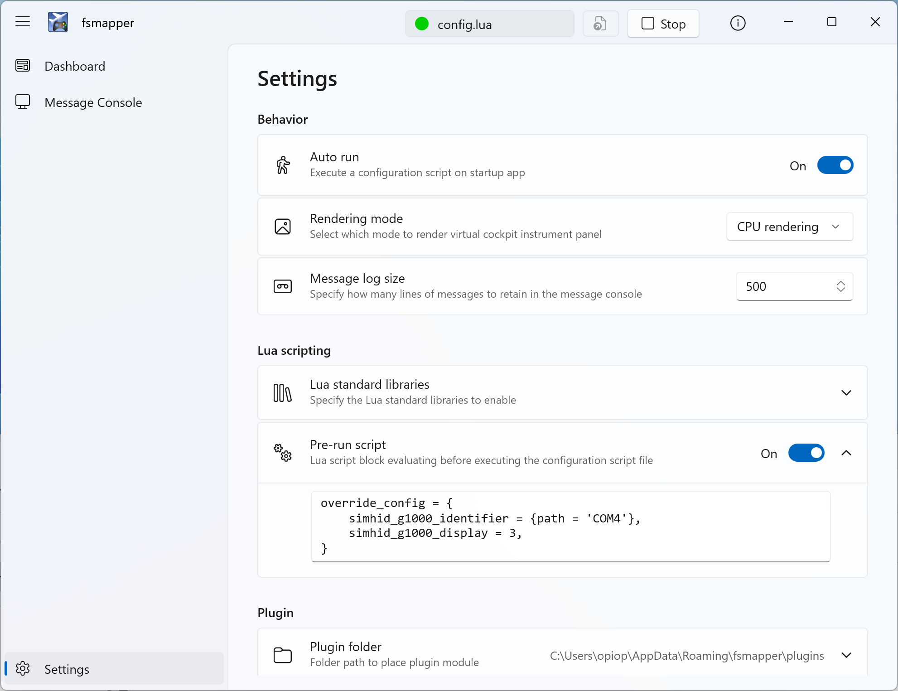

# Sample Scripts
The fsmapper package contains several configuration script samples for practical use of [SimHID G1000](https://github.com/opiopan/simhid-g1000). These scripts can be found at ```samples/practical``` folder under the instration folder of fsmapper.<br/>
To use these scripts, [vJoy driver](https://sourceforge.net/projects/vjoystick) and [MobiFlight WASM module](https://github.com/MobiFlight/MobiFlight-WASM-Module) must be installed. In addition, it's assumed that the virtual serial Port for SimHID G1000 is recognaized as **COM3** and the display for SimHID G1000 is secondary monitor (**moniter No. is 2**).<br/>
If your environment is not same, change ```config``` table defined at the top of each script as below according to your environment.

``` Lua
local config = {
    simhid_g1000_identifier = {path = 'COM3'},
    simhid_g1000_display = 2,
}
```

Alternatively, you can define the `override_config` global variable in the **Pre-run script** of fsmapper's **Settings page** to override the contents of the `config` variable without directly modifying the script.



This method also supports those who do not own the [SimHID G1000](https://github.com/opiopan/simhid-g1000) but want to try the operation of the virtual instrument panel.<br/>
Here is an example of a pre-run script to specify when using the sample script in an environment without [SimHID G1000](https://github.com/opiopan/simhid-g1000).

```lua
override_config = {
    simhid_g1000_display = 1,
    simhid_g1000_display_scale = 0.5,

    simhid_g1000_mock = true, 
    simhid_g1000_mock_proxy = {
        type = 'dinput',
        identifier = {name = 'your_device_name_here'},
        aux_up = 'button1',
        aux_down = 'button2',
        aux_push = 'button3',
    },
 }
```

Please replace placeholders like "your_device_name_here" and specific button names with appropriate values for your setup.
This script will override the configuration variables accordingly when fsmapper is launched.

Here is the meaning of each parameter.

|Parameter|Description
|---------|------------
|`simhid_g1000_display`| Specify the display number for showing the virtual instrument panel. This display should ideally be a touchscreen, but it can also be operated using a mouse.
|`simhid_g1000_display_scale`|Specify the size of the virtual instrument panel display. Use `1` to use the entire screen.
|`simhid_g1000_mock`|If you are not using [SimHID G1000](https://github.com/opiopan/simhid-g1000) or do not own it at all, specify `true`.
|`simhid_g1000_mock_proxy`|The following sample scripts allow you to operate multiple virtual instrument panels by switching between them. This switching operation is assigned to the left and right AUX switches of [SimHID G1000](https://github.com/opiopan/simhid-g1000). If you are not using [SimHID G1000](https://github.com/opiopan/simhid-g1000), you can assign the switching operation to another device using this parameter.<br/>Specify the device to use for this purpose in the `identifier` parameter. Refer to [this guide](/getting-started/tutorial#handle-an-input-device) for descriptions of the `identifier` parameters corresponding to the devices you own.<br/>Specify which buttons of the device identified by `identifier` to use for switching virtual instrument panels using `aux_up`, `aux_down`, and `aux_push` parameters.

Please refer to the following for details on each script.

- [**g1000.lua**](/samples/g1000)
- [**g1000_x56.lua**](/samples/g1000_x56)
- [**a32nx.lua**](/samples/a32nx)
- [**c172.lua**](/samples/c172)

:::info
More complex scripts can be found in [this GitHub repository](https://github.com/opiopan/scripts_for_fsmapper). <br/>
I actually use the scripts stored in that repository(```config.lua```), and the way how to switch the configuration correspond to current aircraft can be found in those scripts.
:::
