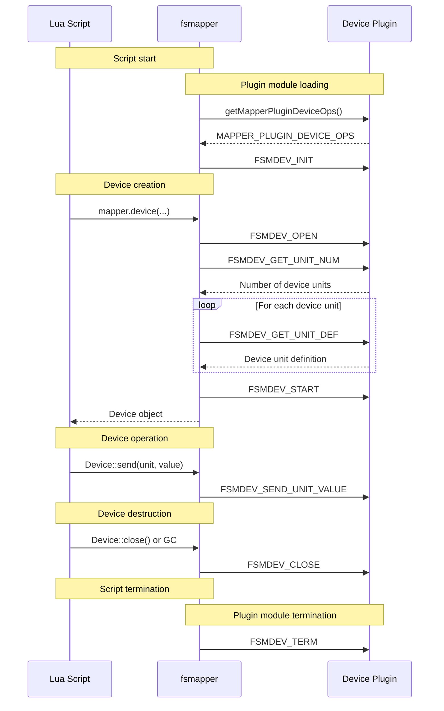

# Plugin ABI

## Plugin Callback Execution Flow {#flow}
The following sequence diagram illustrates when and in what order the plugin callback functions are invoked in response to Lua script execution and device operations.

