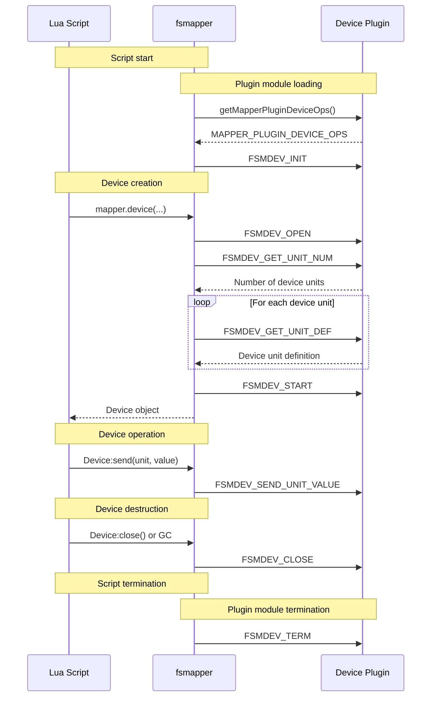

# Plugin ABI

The Plugin ABI defines the contract between fsmapper and a custom device plugin module.

It specifies what a plugin module must provide in order to be recognized and loaded by fsmapper, including the required entry point and callback functions.
This ABI serves as the foundational rulebook for plugin development and is typically the first part developers should become familiar with when designing a new plugin module.

Rather than prescribing how a plugin must be implemented internally, the Plugin ABI focuses on the externally visible interface and the lifecycle interactions between fsmapper, Lua scripts, and the plugin.

## Plugin Entry Point

A plugin module is a dynamically loaded library (DLL) that exports a single required entry point function: [`getMapperPluginDeviceOps`](getMapperPluginDeviceOps).

This function allows fsmapper to discover the plugin’s capabilities by returning a structure that contains pointers to all required callback functions.
If this function is present and correctly exported, fsmapper treats the DLL as a valid plugin module.

The following table lists the required entry point function. Each function name links to its detailed reference page.

|Function|Description|
|---|---|
|[`getMapperPluginDeviceOps`](getMapperPluginDeviceOps)|Returns a structure containing the plugin’s callback function pointers and metadata.|

## Plugin Callback Functions

In addition to the entry point, a plugin module must implement a fixed set of callback functions.
These callbacks are invoked by fsmapper in response to Lua script execution and device lifecycle events.

All callback functions are mandatory and must be provided by the plugin module.
Null pointers are not permitted.

The following table lists the required callback functions. Each function name links to its detailed reference page.

|Callback|Description|
|---|---|
|[`FSMDEV_INIT`](FSMDEV_INIT)|Initializes plugin-level resources for a Lua script execution.|
|[`FSMDEV_TERM`](FSMDEV_TERM)|Releases plugin-level resources when a Lua script terminates.|
|[`FSMDEV_OPEN`](FSMDEV_OPEN)|Creates and initializes a device instance.|
|[`FSMDEV_START`](FSMDEV_START)|Starts device processing and enables input event generation.|
|[`FSMDEV_CLOSE`](FSMDEV_CLOSE)|Closes a device instance and releases device-specific resources.|
|[`FSMDEV_GET_UNIT_NUM`](FSMDEV_GET_UNIT_NUM)|Returns the number of device units provided by the device.|
|[`FSMDEV_GET_UNIT_DEF`](FSMDEV_GET_UNIT_DEF)|Returns the definition of a device unit.|
|[`FSMDEV_SEND_UNIT_VALUE`](FSMDEV_SEND_UNIT_VALUE)|Receives updated values for output device units.|

## Plugin Callback Execution Flow {#flow}

The following sequence diagram illustrates when and in what order the plugin callback functions are invoked in response to Lua script execution and device operations.

