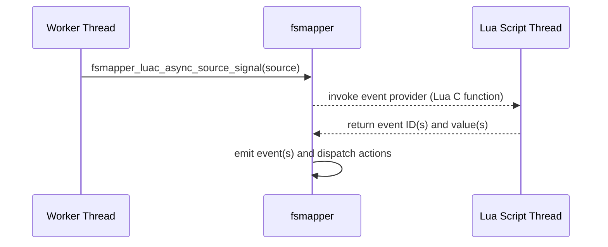

# Asynchronous Event Source

This section describes the **Asynchronous Event Source** mechanism provided by fsmapper for Lua C modules.

Asynchronous Event Source is designed for cases where an fsmapper event must carry an **arbitrary Lua object** as its value, such as a table or other composite type.
Because such values require interaction with the Lua stack, special care is required to ensure correct execution across threads.


## Motivation

Basic Functions allow Lua C modules to emit events from any thread, but only with **scalar values**.
When an event value must be a Lua object, the Lua stack must be accessed, which is only safe on the Lua script execution thread.

Asynchronous Event Source solves this problem by separating:

- **Event notification**, which may occur on any thread
- **Event construction**, which always occurs on the Lua script execution thread

This separation allows Lua C modules to safely integrate asynchronous native code with fsmapper’s event-driven model.

## Overview

An asynchronous event source provides a mechanism for emitting fsmapper events whose values are arbitrary Lua objects.

An asynchronous event source is represented by a
[`FSMAPPER_LUAC_ASYNC_SOURCE`](./data_types) handle and is associated with:

- A service context, represented by a
  [`FSMAPPER_LUAC_CTX`](./data_types)
- A [Lua C function](https://www.lua.org/manual/5.4/manual.html#lua_CFunction) that acts as the *event provider*
- A Lua object that is passed to the event provider as its argument

The asynchronous event source is created using
[`fsmapper_luac_create_async_source`](./api/fsmapper_luac_create_async_source).
Once created, it can be signaled from any thread using
[`fsmapper_luac_async_source_signal`](./api/fsmapper_luac_async_source_signal).

The following sequence illustrates how an asynchronous event source is used:



In this flow:

- The worker thread only signals that an event is pending
- All Lua stack interaction occurs exclusively on the Lua script execution thread
- fsmapper emits the returned events and invokes corresponding actions


## Creating an Asynchronous Event Source

An asynchronous event source is created using
[`fsmapper_luac_create_async_source`](./api/fsmapper_luac_create_async_source).

At creation time, the following are bound to the source:

- A [Lua C function](https://www.lua.org/manual/5.4/manual.html#lua_CFunction) that acts as the **event provider**
- A Lua object that is passed as an argument to the provider

These Lua values are managed internally by fsmapper and remain valid until the source is released.


## Signaling an Event

To indicate that an event should be emitted, the module calls
[`fsmapper_luac_async_source_signal`](./api/fsmapper_luac_async_source_signal).

This function:

- May be called from **any thread**
- Does not interact with the Lua stack
- Simply notifies fsmapper that the associated provider should be executed

Multiple signals may be coalesced internally; the exact scheduling is managed by fsmapper.


## Event Provider Semantics

The event provider is a [Lua C function](https://www.lua.org/manual/5.4/manual.html#lua_CFunction) invoked by fsmapper on the Lua script execution thread.

When the provider is invoked, the Lua object specified at asynchronous event source creation time is passed to it as an argument.
This allows the provider to access module-defined state or configuration stored in Lua objects.

The provider must return [event information](/guide/event-action-mapping#event) using one of the following forms.

For clarity, the examples below are written in **Lua-style pseudo code**.
Actual implementations are written in C or C++ and must follow the Lua C API calling conventions.

### Single Event

The provider may return a single event ID and value:

```lua title="Lua (pseudo code)"
return evid, value
```

- `evid` must be a numeric event ID
- `value` a Lua object representing the event value

### Multiple Events

The provider may return a table containing multiple events:

```lua title="Lua (pseudo code)"
return {
    { evid = evid1, value = value1 },
    { evid = evid2, value = value2 },
}
```

Each table entry must contain:

- `evid`: a numeric event ID
- `value`: a Lua object representing the event value

If the provider returns data in any other form, no events are emitted.


## Releasing an Asynchronous Event Source

An asynchronous event source must be released explicitly using
[`fsmapper_luac_release_async_source`](./api/fsmapper_luac_release_async_source).

Because releasing the source involves Lua object management, this function requires a [`lua_State`](https://www.lua.org/manual/5.4/manual.html#lua_State) and must be called from a context where the Lua stack is accessible.

As with service contexts, it is the responsibility of the Lua C module to ensure that all asynchronous event sources are released no later than script termination.
Associating the source with a userdata object and releasing it from a [`__gc`](https://www.lua.org/manual/5.4/manual.html#2.5.3) metamethod is a recommended pattern.


## When to Use Asynchronous Event Source

Asynchronous Event Source should be used when:

- An event value must be a Lua object
- Event notification originates from a worker thread
- Lua stack access is required to construct the event value

For scalar-valued events or cases that do not require Lua stack interaction, [**Basic Functions**](basic) provide a simpler and more lightweight alternative.